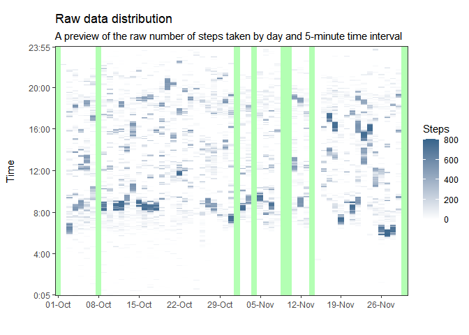

## <span style="color:orange"> Loading and preprocessing the data </span>

**Show any code that is needed to**

  - **Load the data (i.e. read.csv())**
  - **Process/transform the data (if necessary) into a format suitable for your analysis**

The data is downloaded from the forked repository and can be unzipped and loaded into *R* directly:


```r
# Unzip and load file
unzip("./activity.zip")
data <- read.csv("./activity.csv", stringsAsFactors = FALSE)

# Variable "date" as class Date
data$date  <- as.Date(data$date)

# Variable "timelab" for time labels
data$timelab <- paste(rep(0:23,each=12), sprintf("%02d", seq(0, 55, 5)), sep = ":")
data$timelab <- factor(data$timelab, levels = unique(data$timelab))

# Structure of dataset
str(data)
```

```
'data.frame':	17568 obs. of  4 variables:
 $ steps   : int  NA NA NA NA NA NA NA NA NA NA ...
 $ date    : Date, format: "2012-10-01" "2012-10-01" ...
 $ interval: int  0 5 10 15 20 25 30 35 40 45 ...
 $ timelab : Factor w/ 288 levels "0:00","0:05",..: 1 2 3 4 5 6 7 8 9 10 ...
```

**PREVIEW**

In order to **visualize the raw data prior to the analysis**, the following **extra preliminary plot** shows the distribution of the daily steps through time. Step counts are recorded in 5-minute intervals in the dataset. We can easily see there are 8 full days with no recorded steps, encoded with *NA* values and plotted in green below:


```r
library(ggplot2)
ggplot(data = data, aes(x = date, y = timelab)) +
  geom_tile(aes(fill=steps)) +
  labs(x = "", y = "Time\n", title = "Raw data distribution", fill = "Steps",
       subtitle = "A preview of the raw number of steps taken by day and 5-minute time interval") +
  scale_x_date(date_labels = "%d-%b", date_breaks = "1 week") +
  scale_y_discrete(breaks = c("0:05","4:00","8:00","12:00","16:00","20:00","23:55")) +
  scale_fill_gradient(low = "white", high = "steelblue4", na.value = alpha("green",0.3)) +
  coord_fixed(ratio = 0.15, expand = FALSE) +
  theme_bw() + theme(panel.grid = element_blank())
```

<!-- -->


*<span style="color:red"> NOTE: This figure above has been intentionally extra-added to better show the distribution of the raw data before continuing with the required data analysis. The remaining tasks and figures of the Reproducible Research course project are presented hereafter </span>*


## <span style="color:orange"> What is mean total number of steps taken per day? </span>

**For this part of the assignment, you can ignore the missing values in the dataset**

  - **Calculate the total number of steps taken per day**
  - **Make a histogram of the total number of steps taken each day**
  - **Calculate and report the mean and median of the total number of steps taken per day**

The total number of steps by day is computed and stored in the "`mtns`" object:


```r
mtns <- aggregate(steps ~ date, data, sum) # NA ignored by default
head(mtns)
```

```
        date steps
1 2012-10-02   126
2 2012-10-03 11352
3 2012-10-04 12116
4 2012-10-05 13294
5 2012-10-06 15420
6 2012-10-07 11015
```

A histogram is plotted to represent the frequency of the total numbers of steps for each day:


```r
ggplot(data = mtns, aes(x=steps)) +
  geom_histogram(fill = alpha("steelblue2", 0.5), color = "steelblue2", binwidth = 5000) +
  geom_vline(xintercept = mean  (mtns$steps), color = "black", lty = 1, lwd = 1) +
  geom_vline(xintercept = median(mtns$steps), color = "red"  , lty = 2, lwd = 1) +
  geom_rug() +
  labs(x = "Number of steps per day",
       y = "Number of days\n",
       title = "Histogram of total number of steps taken each day",
       subtitle = "Using the dataset with NA values omitted") +
  theme_bw() + theme(panel.grid = element_blank())
```

<!-- -->

The median total number of steps is 10765 whereas the mean is 10766.  
Mean (in black) and median (in red) values are shown as vertical lines in the histogram above:


```r
summary(mtns$steps)
```

```
   Min. 1st Qu.  Median    Mean 3rd Qu.    Max. 
     41    8841   10765   10766   13294   21194 
```


## <span style="color:orange"> What is the average daily activity pattern? </span>

  - **Make a time series plot of the 5-minute interval and the average number of steps taken, averaged across all days**
  - **Which 5-minute interval, on average across all the days in the dataset, contains the maximum number of steps?**

A new dataframe "`adap`"is computed as the number of steps averaged by 5-minute intervals


```r
adap <- aggregate(steps ~ interval+timelab, data, mean) # NA ignored by default
head(adap)
```

```
  interval timelab     steps
1        0    0:00 1.7169811
2        5    0:05 0.3396226
3       10    0:10 0.1320755
4       15    0:15 0.1509434
5       20    0:20 0.0754717
6       25    0:25 2.0943396
```

The time serie is plotted below and includes a vertical line, in red, highlighting the maximum number of steps (206) located in the 5-minute interval between 8:35 and 8:40


```r
ggplot(data = adap, aes(x=interval, y=steps)) +
  geom_line(color = "black") +
  geom_vline(xintercept = adap[which.max(adap$steps), "interval"], color = "red") +
  labs(x = "Time", y = "Average number of steps\n", title = "Average daily activity pattern") +
  scale_x_continuous(breaks = c(0, 600, 835, 1200, 1800, 2355),
                     labels = c("0:00","6:00","8:35","12:00","18:00","23:55")) +
  theme_bw() + theme(panel.grid = element_blank())
```

<!-- -->


## <span style="color:orange"> Imputing missing values </span>

**Note that there are a number of days/intervals where there are missing values (coded as NA). The presence of missing days may introduce bias into some calculations or summaries of the data.**

  - **Calculate and report the total number of missing values in the dataset (i.e. the total number of rows with NAs)**

The total number of missing values in the dataset can be reported with `summary()` and this yields **2304**


```r
summary(is.na(data$steps))
```

```
   Mode   FALSE    TRUE 
logical   15264    2304 
```

The eight days without steps recorded are the following:


```r
unique(data[which(is.na(data$steps)), "date"])
```

```
[1] "2012-10-01" "2012-10-08" "2012-11-01" "2012-11-04" "2012-11-09"
[6] "2012-11-10" "2012-11-14" "2012-11-30"
```

  - **Devise a strategy for filling in all of the missing values in the dataset. The strategy does not need to be sophisticated. For example, you could use the mean/median for that day, or the mean for that 5-minute interval, etc.**

Since there are eight days entirely with NA values, they will be replaced with the averaged number of steps for each 5-minute interval calculated for the whole available time serie, which is the "`adap`" dataframe calculated in a previous question:


```r
adap <- aggregate(steps ~ interval+timelab, data, mean) # NA ignored by default
head(adap)
```

```
  interval timelab     steps
1        0    0:00 1.7169811
2        5    0:05 0.3396226
3       10    0:10 0.1320755
4       15    0:15 0.1509434
5       20    0:20 0.0754717
6       25    0:25 2.0943396
```

  - **Create a new dataset that is equal to the original dataset but with the missing data filled in.**

A new object "`new_data`" is created after replacing the NA values with the average number of steps for every time interval. A new call to `summary()` confirms there is no more NA values in the variable `steps`:


```r
new_data <- data
new_data[which(is.na(new_data$steps)), "steps"] <- adap$steps
summary(new_data$steps)
```

```
   Min. 1st Qu.  Median    Mean 3rd Qu.    Max. 
   0.00    0.00    0.00   37.38   27.00  806.00 
```

  - **Make a histogram of the total number of steps taken each day**

Firstly, the total number of steps by day is computed and stored in the "`new_mtns`" object:


```r
new_mtns <- aggregate(steps ~ date, new_data, sum) # NA ignored by default
head(new_mtns)
```

```
        date    steps
1 2012-10-01 10766.19
2 2012-10-02   126.00
3 2012-10-03 11352.00
4 2012-10-04 12116.00
5 2012-10-05 13294.00
6 2012-10-06 15420.00
```

A histogram is plotted to represent the frequency of the total numbers of steps for each day:


```r
ggplot(data = new_mtns, aes(x=steps)) +
  geom_histogram(fill = alpha("steelblue2", 0.5), color = "steelblue2", binwidth = 5000) +
  geom_vline(xintercept = mean  (new_mtns$steps), color = "black", lty = 1, lwd = 1) +
  geom_vline(xintercept = median(new_mtns$steps), color = "red"  , lty = 2, lwd = 1) +
  geom_rug() +
  labs(x = "Number of steps per day",
       y = "Number of days\n",
       title = "Histogram of total number of steps taken each day",
       subtitle = "Using the new dataset without NA values") +
  theme_bw() + theme(panel.grid = element_blank())
```

<!-- -->

  - **Calculate and report the mean and median total number of steps taken per day**

The median total number of steps is now 10766 and equals the mean of 10766.  
Mean (in black) and median (in red) values are shown as vertical lines in the histogram above


```r
round(median(new_mtns$steps), 0) # Median
```

```
[1] 10766
```

```r
round(mean  (new_mtns$steps), 0) # Mean
```

```
[1] 10766
```

  - **Do these values differ from the estimates from the first part of the assignment? What is the impact of imputing missing data on the estimates of the total daily number of steps?**

These values are in practice the same mean and median values of the original dataset with NA values. In detail, the strategy consisting of NA replacements with average values for each time interval moves the median towards the mean.


```r
# Total number of steps by day (NA omitted)
summary(mtns$steps)
```

```
   Min. 1st Qu.  Median    Mean 3rd Qu.    Max. 
     41    8841   10765   10766   13294   21194 
```

```r
# Total number of steps by day (NA replaced)
summary(new_mtns$steps)
```

```
   Min. 1st Qu.  Median    Mean 3rd Qu.    Max. 
     41    9819   10766   10766   12811   21194 
```


## <span style="color:orange"> Are there differences in activity patterns between weekdays and weekends? </span>

**For this part the `weekdays()` function may be of some help here. Use the dataset with the filled-in missing values for this part.**

  - **Create a new factor variable in the dataset with two levels “weekday” and “weekend” indicating whether a given date is a weekday or weekend day**

Using the `new_data` object, weekdays and weekends will be identified as factors:


```r
# Create variable weekday as factor
new_data$weekday <- weekdays(as.Date(new_data$date))
new_data$weekday <- factor(new_data$weekday, levels = unique(new_data$weekday))

# Save the names of the week
dayNames <- unique(new_data$weekday)

# Separate weekdays and weekends
new_data[which(new_data$weekday %in% dayNames[1:5]), "weekpart"] <- "Weekday"
new_data[which(new_data$weekday %in% dayNames[6:7]), "weekpart"] <- "Weekend"
new_data$weekpart <- factor(new_data$weekpart)

# Dataset final structure
str(new_data)
```

```
'data.frame':	17568 obs. of  6 variables:
 $ steps   : num  1.717 0.3396 0.1321 0.1509 0.0755 ...
 $ date    : Date, format: "2012-10-01" "2012-10-01" ...
 $ interval: int  0 5 10 15 20 25 30 35 40 45 ...
 $ timelab : Factor w/ 288 levels "0:00","0:05",..: 1 2 3 4 5 6 7 8 9 10 ...
 $ weekday : Factor w/ 7 levels "Monday","Tuesday",..: 1 1 1 1 1 1 1 1 1 1 ...
 $ weekpart: Factor w/ 2 levels "Weekday","Weekend": 1 1 1 1 1 1 1 1 1 1 ...
```

  - **Make a panel plot containing a time series plot of the 5-minute interval (x-axis) and the average number of steps taken, averaged across all weekday days or weekend days (y-axis). See the README file in the GitHub repository to see an example of what this plot should look like using simulated data**


```r
# Number of steps averaged across weekdays and weekends
avg_week <- aggregate(steps ~ interval + timelab + weekpart, new_data, mean)

# Panel plot
ggplot(data = avg_week, aes(x = interval, y = steps)) +
  geom_line(color = "steelblue", lwd = 0.5) +
  facet_wrap(.~weekpart, ncol = 1, nrow = 2) +
  labs(x = "\nTime interval", y = "Number of steps\n", title = "Daily steps",
       subtitle = "Average number of steps taken across all weekdays and weekends") +
  scale_x_continuous(breaks = c(0, 600, 1200, 1800, 2355),
                     labels = c("0:00","6:00","12:00","18:00","23:55")) +
  theme_bw() +
  theme(strip.background = element_rect(fill = alpha("steelblue2", 0.3)))
```

<!-- -->

A careful inspection of the figure shows that more steps are taken during the week in the mornings with a maximum between 8:00 and 9:00, while steps are more uniformly distributed during the weekends with no remarkable activity peak. In terms of steps taken, activity seems to be more continuous on Saturdays and Sundays.


